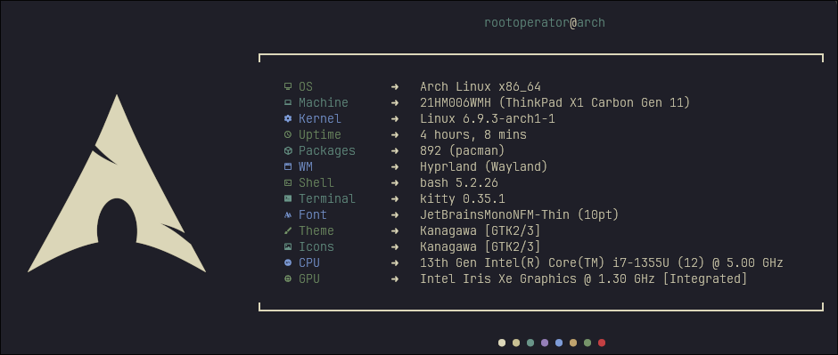

## Info

- 💻 DE:  [HyprLand](https://hyprland.org)
    - 🔒 [HyprLock](https://github.com/hyprwm/hyprlock)
    - 💤 [HyprIdle](https://github.com/hyprwm/hypridle)
    - 🖼️ [HyprPaper](https://github.com/hyprwm/hyprpaper)
- 🖥 DM: [SDDM](https://github.com/sddm/sddm)
- ℹ️  Bar: [WayBar](https://github.com/Alexays/Waybar)
- 💾 Terminal: [Kitty](https://sw.kovidgoyal.net/kitty)
- 📋 Menu: [Rofi](https://github.com/davatorium/rofi)
- 🗃️ File Manager: [Thunar](https://github.com/xfce-mirror/thunar), [Yazi](https://github.com/sxyazi/Yazi)
- 🎨 theme: [Kanagawa](https://github.com/rebelot/kanagawa.nvim)
    - 📒 [Nvim](https://github.com/rebelot/kanagawa.nvim)
    - 🖌️ [GTK](https://github.com/Fausto-Korpsvart/Kanagawa-GKT-Theme)
    - 📋 [Rofi](.config/rofi/colors/kanagawa.rasi)
    - 🐱 [Kitty](https://github.com/rebelot/kanagawa.nvim/blob/master/extras/kitty/kanagawa.conf)
    - 🖥 [SDDM](kanagawa-theme/sddm)
    - 🌐 [FireFox](https://github.com/Haruzona/penguinFox)
        - 🖌️ [Bento](kanagawa-theme/bento/app.css)
    - 💬 [Discord](kanagawa-theme/discord)
        -   🌑 [midnight](kanagawa-theme/discord/midnight-kanagawa.css)
        -   👾 [system24](kanagawa-theme/discord/system24-kanagawa.css)
    - 🎵 [th-ch/youtube-music](kanagawa-theme/ytmusic/kanagawa.css)

## Preview
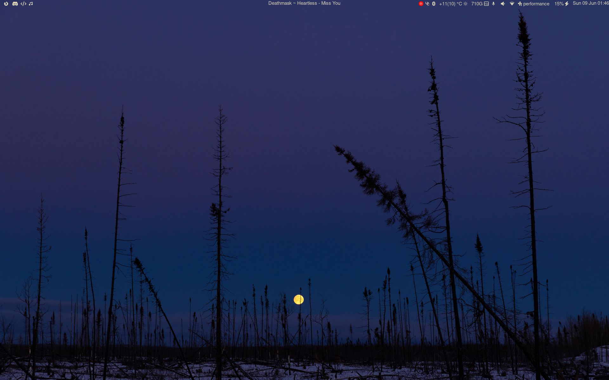
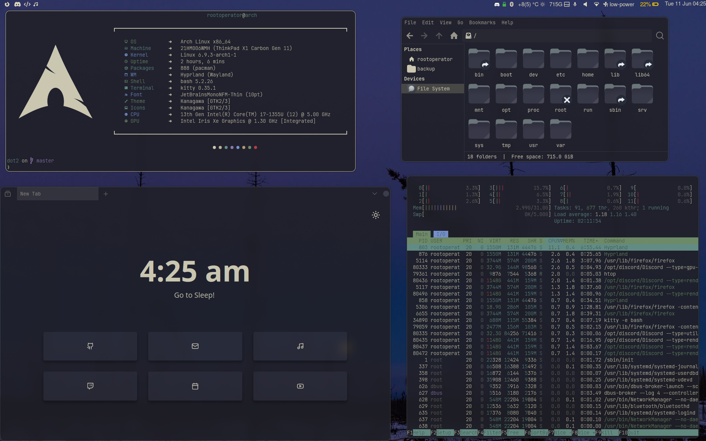
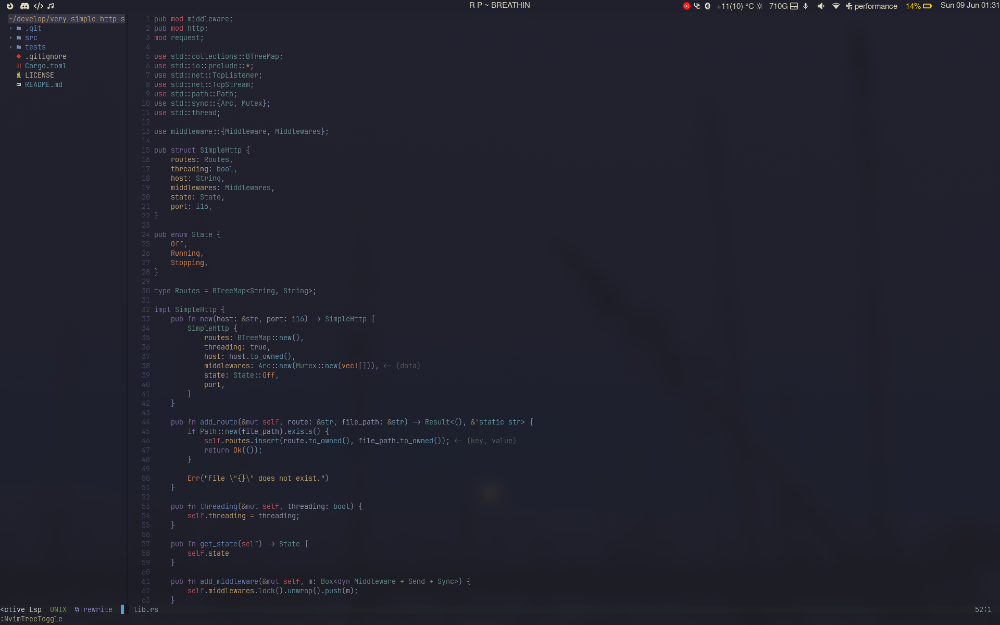
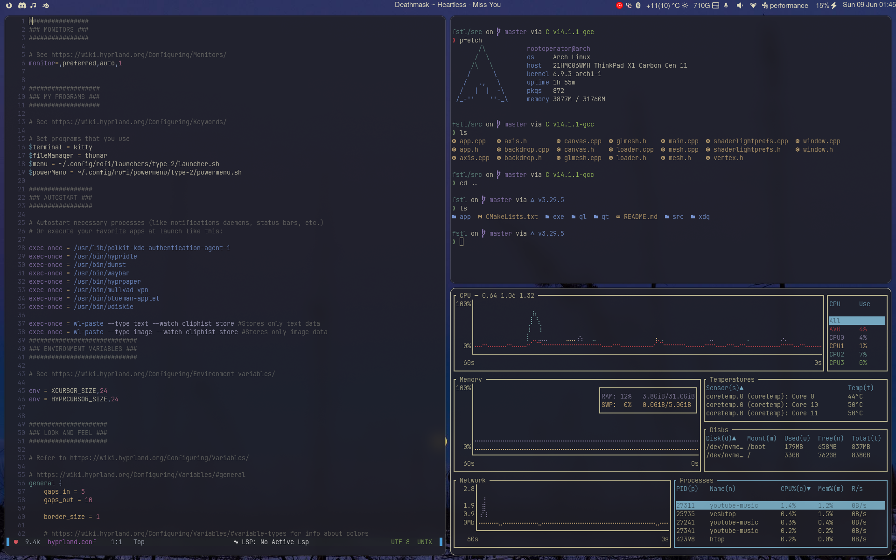
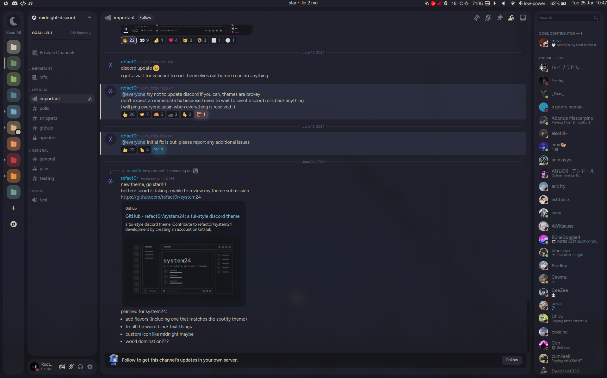

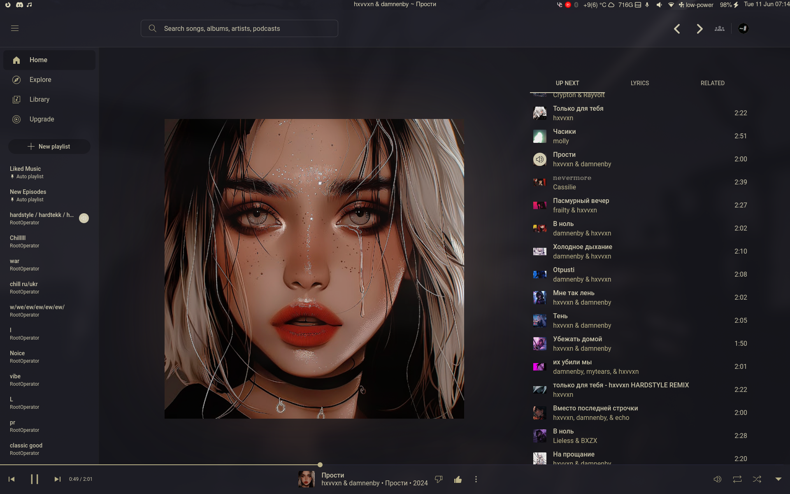
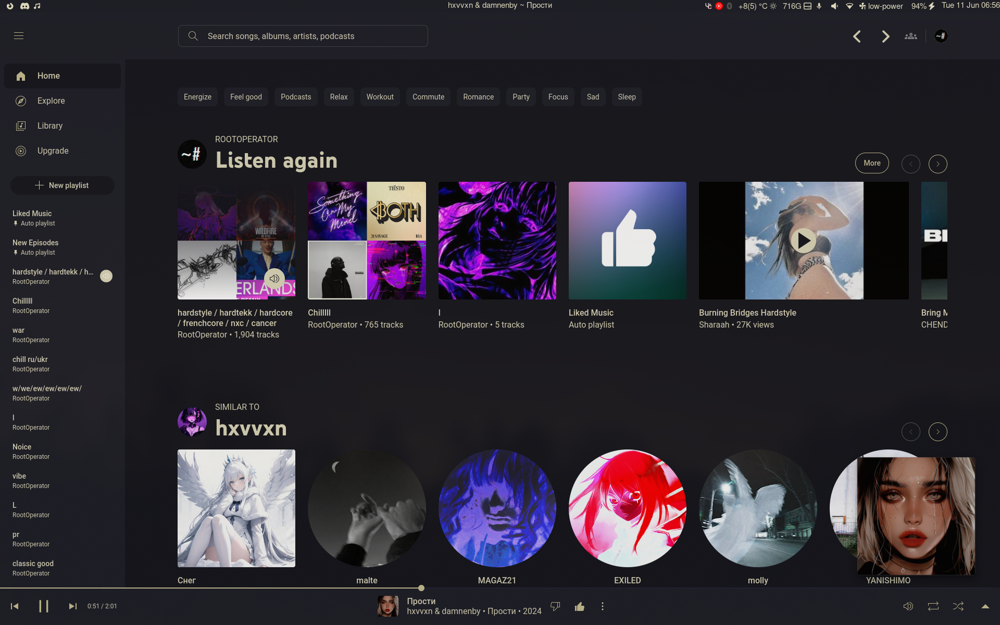
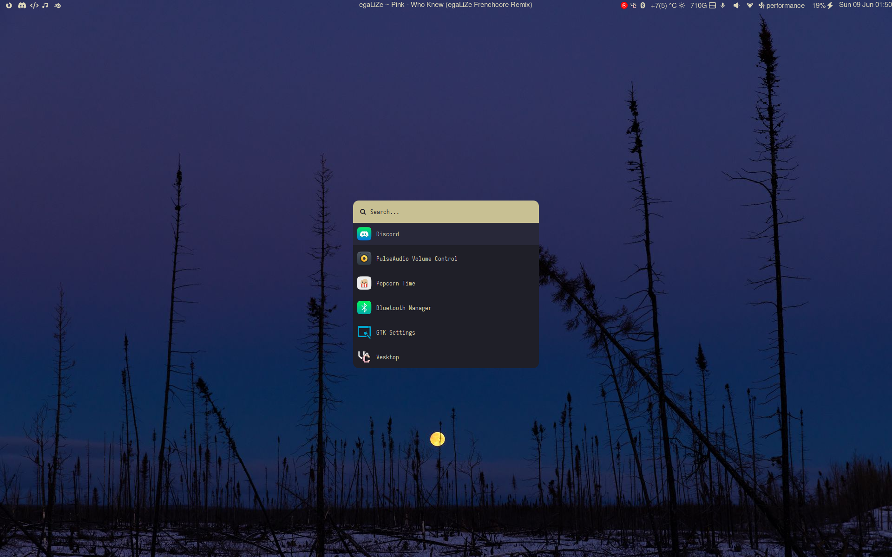
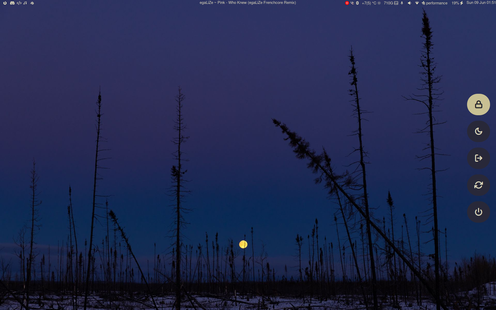

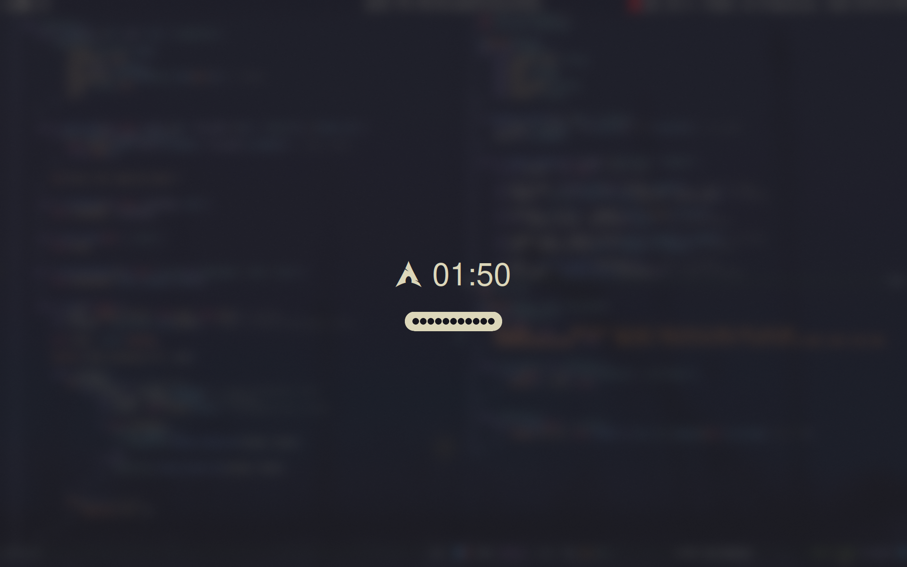
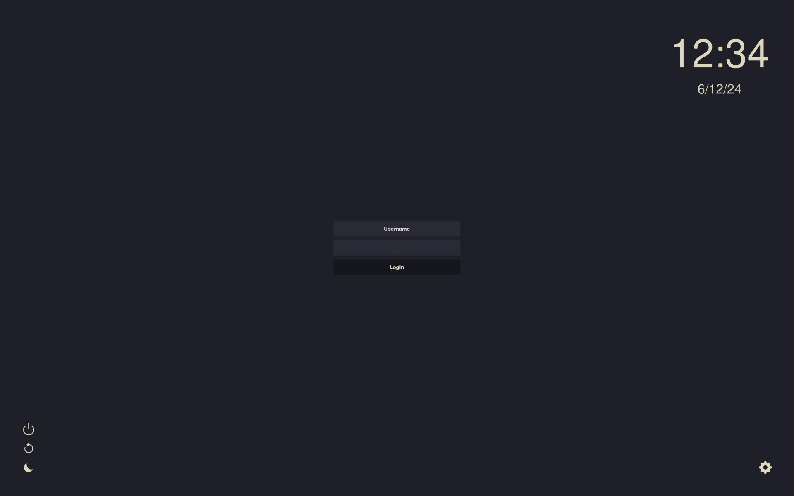
