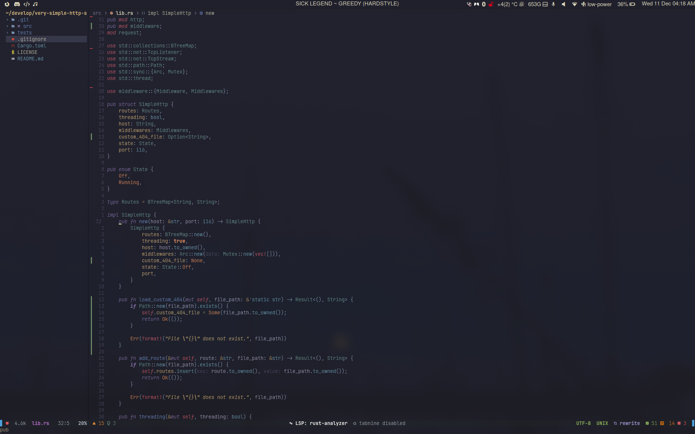
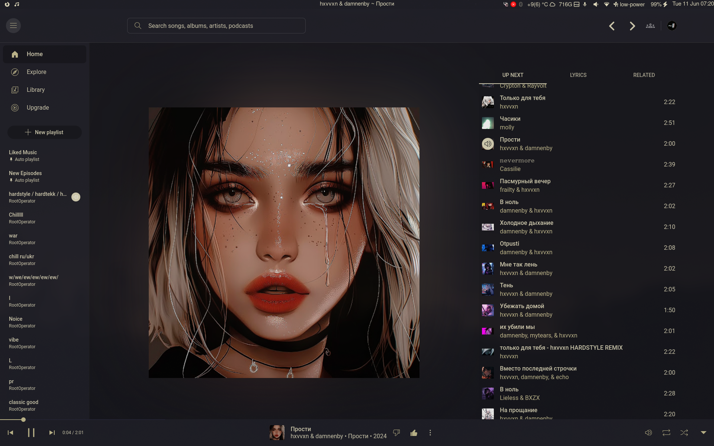
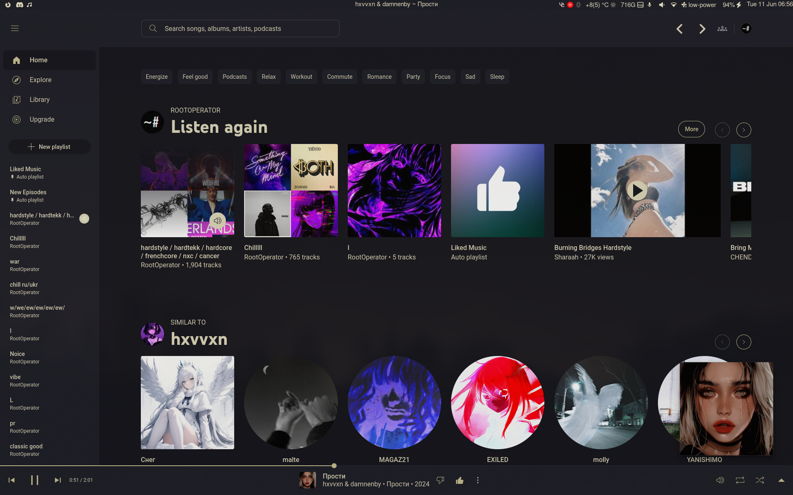
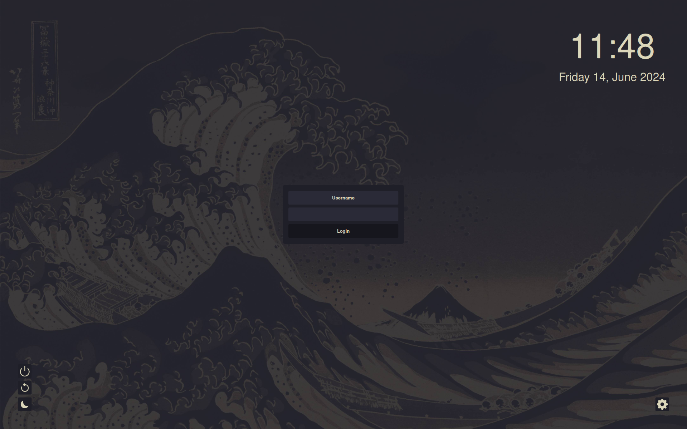

## Info

- 💻 DE:  [HyprLand](https://hyprland.org)
    - 🔒 [HyprLock](https://github.com/hyprwm/hyprlock)
    - 💤 [HyprIdle](https://github.com/hyprwm/hypridle)
    - 🖼 [HyprPaper](https://github.com/hyprwm/hyprpaper)
- 🖥 DM: [SDDM](https://github.com/sddm/sddm)
- â„¹ï¸  Bar: [WayBar](https://github.com/Alexays/Waybar)
- 💾 Terminal: [Kitty](https://sw.kovidgoyal.net/kitty)
- 📋 Menu: [Rofi](https://github.com/davatorium/rofi)
- 🗄 File Manager: [Thunar](https://github.com/xfce-mirror/thunar)
- 🨠theme: [Kanagawa](https://github.com/rebelot/kanagawa.nvim)
    - 🗃 [Nvim](https://github.com/rebelot/kanagawa.nvim)
    - 🖌 [GTK](https://github.com/Fausto-Korpsvart/Kanagawa-GKT-Theme)
    - 🱠[Kitty](https://github.com/rebelot/kanagawa.nvim/blob/master/extras/kanagawa.conf)
    - 🖥 [SDDM](kanagawa-theme/sddm)
    - 🌠[FireFox](https://github.com/Haruzona/penguinFox)
        - 🖌 [Bento](kanagawa-theme/bento/app.css)
    - 💬 [Discord](kanagawa-theme/discord/kanagawa.css)
    - 🵠[th-ch/youtube-music](kanagawa-theme/ytmusic/kanagawa.css)

## Preview

